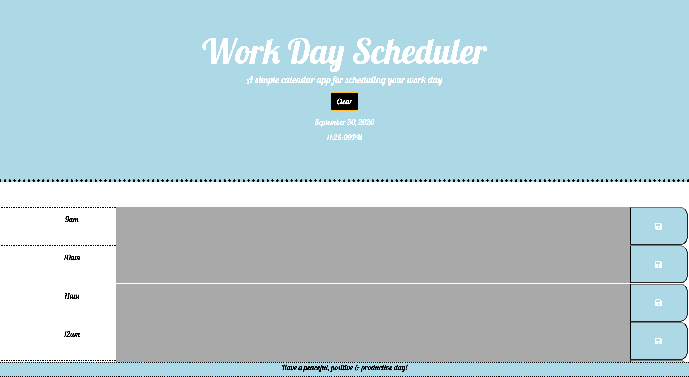

hw5-workdayscheduler

This project requires me to create a simple calendar application that allows a user to save events for each hour of the day by modifying the provided starter code. This app will run in the browser and feature dynamically updated HTML and CSS powered by jQuery.  It will also employ the [Moment.js](https://momentjs.com/) library to work with date and time.

The finished deployed app's interface is a jumbotron header explaining the premise of the app with a button to clear the local storage if needed.  I also included the current date and time to maximize efficencey for the user.  Scrolling down, the user is presented with an 8 hour work day (in this case, 9am - 5pm)displayed in rows in which to enter their hourly tasks.  Each row is capped with a save icon in order to save the inputted task to local storage.  If the user does not click the save icon, any inputted data will be lost upon reload.  If properly saved, then all data will persist upon refresh.  

The time of day the app is accessed will alter the color coding of the time slot blocks.  The hours are set up to display dark grey if the listed time has already passed, white is the hour is present and light blue if the hour is still due to pass.  

Link to deployed app:
https://triciaroush.github.io/hw5-workdayscheduler/

Preview:

Please note: In the deployed image preview, all slots are in grey because the time the photo was taken was after the entire 8 hour block had passed.  Had image been taken between 9am and 5pm, the hour blocks colors' would have fluctuated based on the timestamp.  

